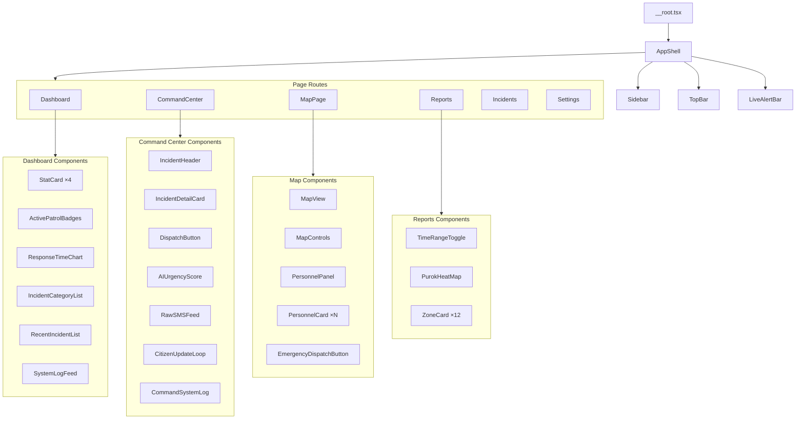

# LihokBarangAI — Component Architecture

> Modular component hierarchy and data flow specification. Reference this when implementing any individual component.

---

## Component Hierarchy



---

## Data Flow Architecture

```
┌─────────────────────────────────────────────────────────────┐
│                     Supabase Backend                         │
│  ┌──────────────┐  ┌──────────┐  ┌───────────────────────┐ │
│  │ raw_messages  │  │ reports  │  │ pending_clarifications│ │
│  └──────────────┘  └──────────┘  └───────────────────────┘ │
│         │                │                    │              │
│         └────────────────┼────────────────────┘              │
│                          │ Supabase Realtime                 │
└──────────────────────────┼───────────────────────────────────┘
                           │
                    ┌──────┴──────┐
                    │ supabase.ts │  (client initialization)
                    └──────┬──────┘
                           │
          ┌────────────────┼────────────────┐
          │                │                │
  ┌───────┴───────┐ ┌─────┴──────┐ ┌──────┴────────┐
  │use-reports.ts │ │use-dash-   │ │use-realtime-  │
  │               │ │stats.ts    │ │reports.ts     │
  └───────┬───────┘ └─────┬──────┘ └──────┬────────┘
          │                │               │
          └────────────────┼───────────────┘
                           │
                    ┌──────┴──────┐
                    │   Pages     │  (consume hooks, pass props down)
                    └─────────────┘
```

### Hook Specifications

#### `use-dashboard-stats(timeRange: '24h' | '7d' | '30d')`
```typescript
interface DashboardStats {
  avgResponseTime: number;       // minutes (computed from created_at → resolved_at)
  avgResponseTimeTrend: number;  // percentage change vs previous period
  totalIncidents: number;
  totalIncidentsTrend: number;
  dispatchEfficiency: number;    // percentage (acknowledged / total)
  activePatrols: number;
  patrolTeams: PatrolTeam[];
  categoryBreakdown: CategoryStat[];
  recentIncidents: ReportSummary[];
  responseTimeSeries: TimeSeriesPoint[];
}
```

#### `use-reports(filters: ReportFilters)`
```typescript
interface ReportFilters {
  status?: ReportStatus[];
  urgencyLevel?: UrgencyLevel[];
  concernType?: ConcernType[];
  dateFrom?: string;
  dateTo?: string;
  search?: string;
  page?: number;
  pageSize?: number;
}

// Returns: { data: Report[], total: number, isLoading, error }
```

#### `use-incident-detail(incidentId: string)`
```typescript
interface IncidentDetail {
  report: Report;
  rawMessages: RawMessage[];
  clarifications: PendingClarification[];
  linkedReports: ReportSummary[];  // same location_zone + concern_type
  aiUrgencyScore: number;         // computed: urgency × confidence × recency
}
```

#### `use-realtime-reports()`
```typescript
// Subscribes to Supabase Realtime channel for `reports` table INSERT events
// Returns: { latestReport: Report | null, connectionStatus: 'connected' | 'disconnected' }
// Triggers re-fetch of dashboard stats when new report arrives
```

---

## Component Props Contracts

### Shell Components

```typescript
// AppShell — no external props, reads route context
interface AppShellProps {
  children: React.ReactNode;
}

// SidebarNavItem
interface SidebarNavItemProps {
  icon: LucideIcon;
  label: string;
  href: string;
  isActive?: boolean;
}

// TopBar
interface TopBarProps {
  onSearch?: (query: string) => void;
  notificationCount?: number;
}

// LiveAlertBar
interface LiveAlertBarProps {
  latestAlert?: {
    message: string;
    timestamp: string;
    type: 'critical' | 'warning' | 'info';
  };
  isConnected: boolean;
}
```

### Dashboard Components

```typescript
// StatCard
interface StatCardProps {
  icon: LucideIcon;
  iconColor?: string;
  value: string | number;
  unit?: string;
  label: string;
  trend?: number;          // percentage, positive = up
  trendDirection?: 'up' | 'down';
  trendIsGood?: boolean;   // green when true, red when false
  subtitle?: string;
  onClick?: () => void;
}

// IncidentCategoryItem
interface IncidentCategoryItem {
  name: string;
  percentage: number;
  count?: number;
}

// RecentIncident
interface RecentIncident {
  id: string;
  urgency: UrgencyLevel;
  location: string;
  clusterName: string;
  timeAgo: string;
}

// SystemLogEntry
interface SystemLogEntry {
  id: string;
  message: string;
  timeAgo: string;
  type: 'dispatch' | 'system' | 'alert';
}
```

### Command Center Components

```typescript
// AIUrgencyScore
interface AIUrgencyScoreProps {
  score: number;           // 0-100
  maxScore: number;        // typically 100
  reasoning: string;
  isRealtime: boolean;
}

// RawSMSFeedEntry
interface RawSMSFeedEntry {
  timestamp: string;
  origin: string;          // phone number
  content: string;
  status: 'verified' | 'processing' | 'pending';
}

// CitizenUpdateLoop
interface CitizenUpdateLoopProps {
  incidentId: string;
  onSendBroadcast: (message: string) => Promise<void>;
}
```

### Map Components

```typescript
// PersonnelCard
interface PersonnelCardProps {
  id: string;
  name: string;             // "BDRRMC Team Alpha"
  location: string;         // "Sitio Mansanitas"
  status: 'online' | 'offline' | 'deployed';
  actionLabel: 'Deploy' | 'Re-assign' | 'Message';
  onAction: () => void;
}

// MapView
interface MapViewProps {
  incidents: GeoIncident[];
  center?: [number, number]; // [lng, lat]
  zoom?: number;
  onIncidentClick?: (id: string) => void;
}

interface GeoIncident {
  id: string;
  lat: number;
  lng: number;
  urgency: UrgencyLevel;
  summary: string;
  concernType: ConcernType;
}
```

### Reports Components

```typescript
// ZoneCard
interface ZoneCardProps {
  zoneId: string;           // "ZONE 01"
  label: string;            // "Safe Level"
  density: 'safe' | 'increased' | 'moderate' | 'high' | 'critical';
  incidentCount?: number;
  onClick?: () => void;
}

// TimeRangeToggle
interface TimeRangeToggleProps {
  value: '24h' | '7d' | '30d';
  onChange: (value: '24h' | '7d' | '30d') => void;
}
```

---

## Styling Conventions

### CSS Class Naming
All custom CSS uses **Tailwind CSS v4 utility classes** via the existing `cn()` utility. Custom component classes use the `data-slot` attribute pattern from shadcn/ui:

```tsx
<div data-slot="stat-card" className={cn("rounded-xl border bg-card p-6", className)}>
```

### Color Application Rules
1. **Never hardcode hex/oklch values in components** — always use CSS variable tokens via Tailwind
2. **Urgency colors** use the semantic `--urgency-*` tokens, not generic red/orange/yellow
3. **Surface hierarchy**: `bg-background` (page) → `bg-card` (elevated) → `bg-muted` (recessed)
4. **Interactive states**: hover uses `bg-accent`, active uses `bg-primary` with `text-primary-foreground`

### Spacing Scale
Follow Tailwind defaults:
```
4px  (p-1)  — tight internal padding
8px  (p-2)  — compact cards
12px (p-3)  — standard internal padding
16px (p-4)  — comfortable card padding
24px (p-6)  — section padding, major gaps
32px (p-8)  — page margins
```

### Border Radius
Use the CSS variable scale from `globals.css`:
```
--radius-sm  — small elements (badges, chips)
--radius-md  — buttons, inputs
--radius-lg  — cards (default)
--radius-xl  — stat cards, major surfaces
```

---

## State Management Strategy

### No Global State Store
This app does not need Redux/Zustand. Data flows through:
1. **Server state**: TanStack Query (via hooks) for all Supabase data
2. **URL state**: TanStack Router search params for filters (urgency, date range, search)
3. **Local component state**: React `useState` for UI state (sidebar collapsed, message drafts)
4. **Real-time state**: Supabase Realtime subscriptions managed by hooks

### Why No Store
- Each page is largely independent (no shared mutable state between pages)
- Filters are URL-driven (shareable, bookmarkable)
- Real-time updates are push-based (subscription → callback → re-fetch)

---

## Testing Strategy

### Component Testing
Each component should have:
1. **Visual snapshot** — verify render matches design
2. **Accessibility test** — `@testing-library/react` with `axe` integration
3. **Interaction test** — click handlers, keyboard navigation

### Integration Testing
- Dashboard: verify stat cards render with mock data
- Command Center: verify incident detail loads and SMS feed updates
- Map: verify markers render at correct positions

### E2E Testing (future)
- Playwright for full page flows
- Visual regression via screenshot comparison against design mockups
